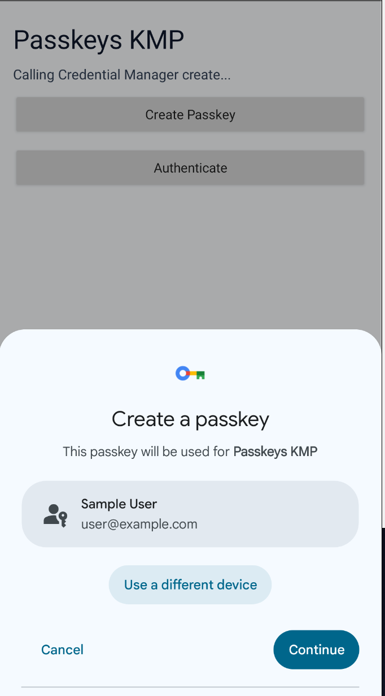
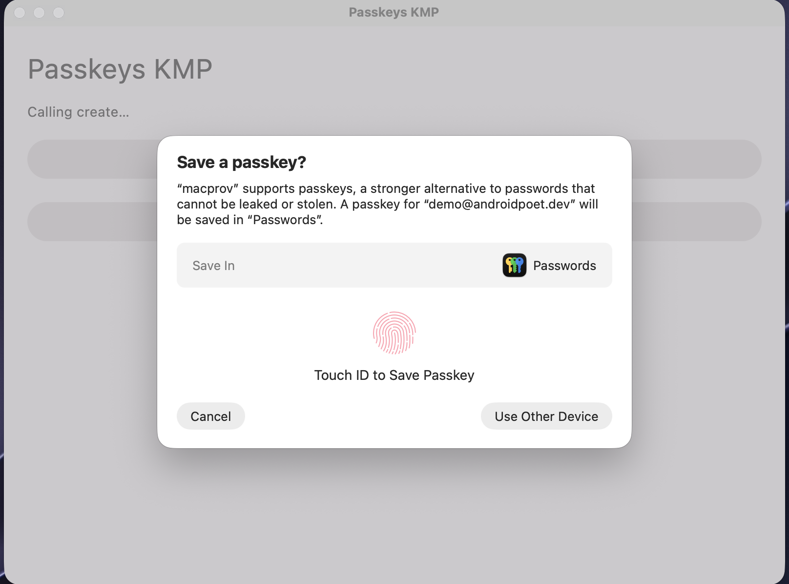
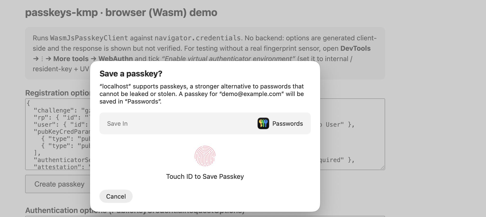

<p align="center">
  
</p>

<h1 align="center">Passkeys KMP</h1>

<p align="center"><b>Simple. Secure. Passwordless.</b></p>

<p align="center">
  <a href="https://central.sonatype.com/artifact/io.github.androidpoet/passkeys"></a>
  <a href="https://kotlinlang.org"></a>
  <a href="LICENSE"></a>
</p>

<p align="center">
  
  
  
  
  
  
  
</p>

<p align="center">
One common <b>passkeys (WebAuthn)</b> API for Kotlin Multiplatform, backed by real native
authenticators on Android, iOS, macOS, Windows, Linux, browser (Wasm), and JVM/Compose Desktop.
</p>

## Install

```kotlin
implementation("io.github.androidpoet:passkeys:0.1.0")          // core SDK
implementation("io.github.androidpoet:passkeys-compose:0.1.0")  // rememberPasskeyClient() (Compose MP)
```

## Usage

One call site, every platform — `create` / `authenticate` return a `PasskeyResult`:

```kotlin
val passkeys = rememberPasskeyClient()   // resolves the platform client + its UI anchor

when (val result = passkeys.create(registrationOptionsJson)) {   // or .authenticate(...)
    is PasskeyResult.Success -> sendToBackend(result.value.rawJson) // verify on your server
    is PasskeyResult.Failure -> handle(result.error.code, result.error.message)
}
```

## Platforms

| Platform | Authenticator | Anchor (auto via Compose) | One-time setup |
| --- | --- | --- | --- |
| Android (API 28+) | Fingerprint / face / PIN | `Activity` | `assetlinks.json` |
| iOS 16+ | Face ID / Touch ID | `UIWindow` | entitlement + AASA |
| macOS 13+ | Touch ID | `NSWindow` | entitlement + AASA |
| JVM / Compose Desktop | Touch ID (macOS) | window handle | signed `.app` + entitlement |
| Browser (Wasm) | Platform / security key | — | HTTPS |
| Windows 10 1903+ | Windows Hello / security key | `HWND` | — |
| Linux | Roaming USB/NFC key only | — | `libfido2` + udev rules |

<details>
<summary><b>📸 See the native authenticator on each platform</b></summary>

<br/>

Same shared `create` call, each platform's own native authenticator UI:

| Android — Credential Manager | macOS — Touch ID | Browser (Wasm) |
| :---: | :---: | :---: |
|  |  |  |

</details>

## Domain setup

A passkey is bound to your domain, so each platform needs proof you own it. Host these
two files under `https://your-domain.com/.well-known/` (web just needs HTTPS):

```jsonc
// assetlinks.json  (Android)
[{ "relation": ["delegate_permission/common.get_login_creds"],
   "target": { "namespace": "android_app", "package_name": "com.your.app",
               "sha256_cert_fingerprints": ["YOUR:APP:SIGNING:SHA256"] } }]
```

```jsonc
// apple-app-site-association  (iOS + macOS — no extension, served as application/json)
{ "webcredentials": { "apps": ["TEAMID.com.your.app"] } }
```

Then add the **Associated Domains** entitlement to your Apple target:

```xml
<key>com.apple.developer.associated-domains</key>
<array><string>webcredentials:your-domain.com</string></array>
```

## Verify on your server

The SDK only runs the device ceremony — a passkey is trustworthy **only after your backend
verifies it**. Your server generates a fresh `challenge` into the options JSON, you pass that
to `create` / `authenticate`, then POST `result.value.rawJson` back to verify and store it.
Use a maintained WebAuthn server library — [java-webauthn-server](https://github.com/Yubico/java-webauthn-server),
[webauthn4j](https://github.com/webauthn4j/webauthn4j), [SimpleWebAuthn](https://simplewebauthn.dev/),
or [py_webauthn](https://github.com/duo-labs/py_webauthn) — to check the challenge, origin,
RP ID, signature, and sign-count. `rawJson` carries every field they expect.

<details>
<summary><b>JVM / Compose Desktop — native macOS passkeys</b></summary>

On macOS, `JvmPasskeyClient` drives the real Touch ID ceremony via a bundled native backend
(`libPasskeysNative.dylib`, a Swift + JNI shim over AuthenticationServices). The ceremony
**only runs from a signed `.app`** carrying the restricted `com.apple.developer.associated-domains`
entitlement with an embedded provisioning profile — a bare `java -jar` will not launch. On
Windows/Linux (or if the native backend can't load) the client fails loud; use browser handoff:

```kotlin
PasskeyBrowserHandoff.open("https://your-rp.example/passkey/sign-in")
```
</details>

<details>
<summary><b>Apple extensions (iOS & macOS)</b></summary>

- `largeBlob`: iOS 17+ / macOS 14+ — `prf`: iOS 18+ / macOS 15+
- Unsupported OS versions fail with `PasskeyException.Unsupported` before any UI
- Extension outputs are preserved in `rawJson.clientExtensionResults`
</details>

<details>
<summary><b>Linux — security keys only</b></summary>

No platform/biometric authenticator, so `LinuxPasskeyClient` supports roaming USB/NFC security
keys via libfido2. Requires `libfido2-dev` / `libfido2-devel` and udev rules granting non-root
access. Platform and phone/hybrid passkeys fail with a typed `PasskeyException`.
</details>

## Sample

`:sample:composeApp` is one Compose Multiplatform app — the whole UI lives in `commonMain`,
each entry point is just `App()`. Supply your own domain via a `-P` flag:

```sh
./gradlew :sample:composeApp:installDebug -PpasskeysSampleRpId=your-domain.com   # Android
./gradlew :sample:composeApp:run -PpasskeysSampleRpId=your-domain.com            # macOS desktop
```

…or, so you don't repeat it every build, put it in `local.properties` (gitignored, keeps your
domain private):

```properties
passkeysSampleRpId=your-domain.com
passkeysSampleBundleId=com.your.app
```

A browser demo lives in `:sample:web`.

## Build & test

```sh
./gradlew :passkeys:allTests spotlessCheck detekt apiCheck
./gradlew :passkeys:assemble :passkeys:publishToMavenLocal
```

## Contributing

Issues and PRs are welcome. Before opening a PR, run the gates:

```sh
./gradlew spotlessApply detekt apiCheck
```

`apiCheck` guards the public API — if you change it intentionally, regenerate the
dump with `./gradlew apiDump` and commit it.

## Find this useful?

Give the repo a ⭐ — it helps others discover it.

## License

```
MIT License

Copyright (c) 2026 Ranbir Singh
```

See [LICENSE](LICENSE) for the full text.
