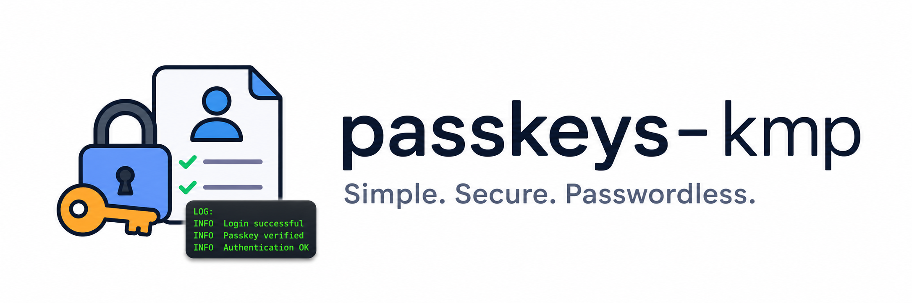

<p align="center">
  
</p>

<h1 align="center">Passkeys KMP</h1>

<p align="center"><b>Simple. Secure. Passwordless.</b></p>

Kotlin Multiplatform passkeys SDK with common WebAuthn models and native passkey clients for Android, Apple, Windows, Linux, browser (Wasm), and JVM desktop.

## Modules

- `:passkeys` - common WebAuthn payload/result contracts plus per-platform passkey operations (Android, iOS, macOS, Windows, Linux, browser/Wasm, JVM desktop).

## Install

```kotlin
implementation("io.github.androidpoet:passkeys:0.1.0")
```

Android passkeys require API 28+ and Digital Asset Links configured for your relying party domain.
iOS passkeys require iOS 16+ and an Associated Domains entitlement with `webcredentials:your-domain.com`.
The Android implementation is pinned to stable AndroidX Credentials `1.6.0`, including conditional passkey creation support.

## Platform Support

- Android: real passkey create/authenticate through AndroidX Credential Manager.
- iOS: real passkey create/authenticate through AuthenticationServices.
- macOS: real passkey create/authenticate through AuthenticationServices (macOS 13+). Shares the iOS ceremony; the system Touch ID sheet is parented to your `NSWindow`.
- Browser (Wasm): real passkey create/authenticate through `navigator.credentials`, using the browser's own WebAuthn JSON serialization (Baseline March 2025).
- Windows: `WindowsPasskeyClient` drives real Windows Hello (fingerprint / face / PIN) or a tapped USB/NFC security key through the OS WebAuthn API (`webauthn.dll`, Windows 10 1903+).
- JVM desktop (Compose Desktop): on **macOS**, `JvmPasskeyClient` drives the real Touch ID / saved-passkey sheet through a bundled native backend (a Swift + JNI bridge over AuthenticationServices). On Windows/Linux it fails loud — use `PasskeyBrowserHandoff` there.
- Linux: `LinuxPasskeyClient` drives roaming **USB/NFC security keys** via libfido2. Linux has no OS platform/biometric authenticator, so platform passkeys and phone/hybrid are not available — those requests fail loud.

Real device verification requires domain association and backend challenge verification. Use [docs/e2e-real-device.md](docs/e2e-real-device.md) before release.

## One codebase, every platform (`:sample:composeApp`)

`:sample:composeApp` is a single Compose Multiplatform app whose entire UI **and
client setup** live in `commonMain` (`App.kt`). There is one common call site —
`rememberPasskeyClient()` — so no platform client is ever named in shared code.
Each platform's entry point just calls `App()`:

```kotlin
// commonMain — identical on every platform.
@Composable
fun App(rpId: String = RP_ID) {
    val passkeys = rememberPasskeyClient()           // resolves the platform client + anchor
    // ... passkeys.create(...) / passkeys.authenticate(...) -> PasskeyResult
}

// commonMain — the only platform seam, an expect/actual factory:
@Composable expect fun rememberPasskeyClient(): PasskeyClient
```

| Platform | Entry point | `rememberPasskeyClient()` resolves to | Authenticator |
| --- | --- | --- | --- |
| Android | `MainActivity` → `App()` | `AndroidPasskeyClient(activity)` | Credential Manager (fingerprint/face/PIN) |
| iOS | `MainViewController()` → `App()` | `IosPasskeyClient(keyWindow)` | AuthenticationServices (Face ID / Touch ID) |
| macOS desktop (JVM) | `main()` → `App()` | `JvmPasskeyClient()` | AuthenticationServices via native JNI (Touch ID) |

The shared client API (`create` / `authenticate` → `PasskeyResult`) is identical
everywhere; the desktop target uses the same native AuthenticationServices
ceremony as iOS/macOS, bridged into the JVM (see
[JVM Desktop](#jvm-desktop-compose-desktop)).

### Configuring & running the sample

The sample ships **no real domain or bundle id** — supply your own:

```sh
# Android (installs to a connected certified device/emulator)
./gradlew :sample:composeApp:installDebug -PpasskeysSampleRpId=your-domain.com

# macOS desktop (run unsigned to see the UI; create/authenticate need a signed .app)
./gradlew :sample:composeApp:run -PpasskeysSampleRpId=your-domain.com

# Package the macOS .app, then sign with your Associated Domains entitlement + profile
./gradlew :sample:composeApp:createDistributable \
  -PpasskeysSampleRpId=your-domain.com -PpasskeysSampleBundleId=com.your.app
```

`passkeysSampleRpId` is injected into `commonMain` at build time (generated
`SampleConfig.kt`); `passkeysSampleBundleId` sets the macOS bundle id. For iOS,
edit `sample/composeApp/iosApp/iosApp/iosApp.entitlements` (the
`webcredentials:` domain) and pass `PRODUCT_BUNDLE_IDENTIFIER` / `DEVELOPMENT_TEAM`
to `xcodebuild`. Your relying party must publish matching `assetlinks.json`
(Android) and `apple-app-site-association` (Apple) under `/.well-known/`.

## Android Usage

```kotlin
val passkeys = AndroidPasskeyClient(activity)

when (val result = passkeys.create(registrationOptionsJson)) {
    is PasskeyResult.Success -> {
        val responseJson = result.value.rawJson
        // Send responseJson to your backend for WebAuthn registration verification.
    }
    is PasskeyResult.Failure -> {
        // Inspect result.error.code and result.error.message.
    }
}

when (val result = passkeys.authenticate(authenticationOptionsJson)) {
    is PasskeyResult.Success -> {
        val responseJson = result.value.rawJson
        // Send responseJson to your backend for WebAuthn assertion verification.
    }
    is PasskeyResult.Failure -> {
        // Inspect result.error.code and result.error.message.
    }
}
```

Use `PasskeyCreationOptions(preferImmediatelyAvailableCredentials = true)` only for opportunistic creation attempts where the platform should fail quickly instead of showing UI for remote or unavailable credentials. Use `isConditionalCreateRequest = true` only after a successful password sign-in flow where Credential Manager can create a passkey without the normal bottom sheet.

`registrationOptionsJson` may be either the direct WebAuthn `PublicKeyCredentialCreationOptions` JSON or a `{ "publicKey": ... }` wrapper. `authenticationOptionsJson` may be either the direct `PublicKeyCredentialRequestOptions` JSON or a `{ "publicKey": ... }` wrapper.

## iOS Usage

```kotlin
val passkeys = IosPasskeyClient(window)

when (val result = passkeys.create(registrationOptionsJson)) {
    is PasskeyResult.Success -> {
        val responseJson = result.value.rawJson
        // Send responseJson to your backend for WebAuthn registration verification.
    }
    is PasskeyResult.Failure -> {
        // Inspect result.error.code and result.error.message.
    }
}
```

## macOS Usage

```kotlin
val passkeys = MacosPasskeyClient(window) // an NSWindow to anchor the system sheet

when (val result = passkeys.authenticate(authenticationOptionsJson)) {
    is PasskeyResult.Success -> {
        val responseJson = result.value.rawJson
        // Send responseJson to your backend for WebAuthn assertion verification.
    }
    is PasskeyResult.Failure -> {
        // Inspect result.error.code and result.error.message.
    }
}
```

macOS 13 (Ventura)+ and an Associated Domains entitlement (`webcredentials:your-domain.com`) are required. `create` works the same way as on iOS.

Apple extension support (iOS and macOS share one implementation):

- `largeBlob` registration/authentication is wired on iOS 17+ / macOS 14+.
- `prf` registration/authentication is wired on iOS 18+ / macOS 15+.
- Unsupported OS versions fail with `PasskeyException.Unsupported` before native UI is shown.
- Requested extension outputs are preserved in `clientExtensionResultsJson` and in `rawJson.clientExtensionResults`.

## Browser (Wasm) Usage

```kotlin
val passkeys = WasmJsPasskeyClient()

when (val result = passkeys.authenticate(authenticationOptionsJson)) {
    is PasskeyResult.Success -> {
        val responseJson = result.value.rawJson
        // Send responseJson to your backend for WebAuthn assertion verification.
    }
    is PasskeyResult.Failure -> {
        // Inspect result.error.code and result.error.message.
    }
}
```

Runs in a secure context (HTTPS or `localhost`). Options and responses cross the
JS boundary as JSON via `PublicKeyCredential.parseCreationOptionsFromJSON` /
`parseRequestOptionsFromJSON` and `toJSON()`, so base64url ↔ `ArrayBuffer`
conversion is handled by the browser. Browsers without those methods fail with
`PasskeyException.Unsupported`.

## Windows Usage

```kotlin
val passkeys = WindowsPasskeyClient(windowHandle) // HWND of your top-level window, as a Long

when (val result = passkeys.authenticate(authenticationOptionsJson)) {
    is PasskeyResult.Success -> {
        val responseJson = result.value.rawJson
        // Send responseJson to your backend for WebAuthn assertion verification.
    }
    is PasskeyResult.Failure -> {
        // Inspect result.error.code and result.error.message.
    }
}
```

Backed by the OS WebAuthn API (`webauthn.dll`, shipped with Windows 10 1903+),
so `create`/`authenticate` show the real Windows Hello sheet: fingerprint, face,
or PIN for the platform authenticator, or a tapped USB/NFC security key. Nothing
is bundled — the binding links the OS-provided import library.

The system sheet must be parented to a window. Pass your top-level window handle
(`HWND`, as a raw `Long`); when `0` it falls back to the foreground window and
then the console window. The expected `origin` defaults to `https://<rpId>`;
pass `origin` to override. On Windows builds whose WebAuthn API already returns a
serialized response, that JSON is used directly; otherwise the WebAuthn
registration/assertion JSON is assembled from the native structs.

## JVM Desktop (Compose Desktop)

On **macOS**, `JvmPasskeyClient` drives the *real* platform authenticator
(Touch ID and iCloud-Keychain passkeys) from the JVM. It loads a bundled native
backend — `libPasskeysNative.dylib`, a Swift + JNI shim over
`AuthenticationServices`, built from `passkeys/src/jvmMain/native/macos` — so no
browser hand-off is needed:

```kotlin
// Anchor the system sheet to your Compose window.
val passkeys = JvmPasskeyClient(windowHandle = { window.windowHandle })

when (val result = passkeys.create(registrationOptionsJson)) {
    is PasskeyResult.Success -> { /* result.value.rawJson -> backend */ }
    is PasskeyResult.Failure -> { /* result.error.code / message */ }
}
```

> **macOS packaging requirement.** A passkey ceremony only runs from a **signed
> `.app`** carrying the `com.apple.developer.associated-domains`
> (`webcredentials:<rpId>`) entitlement — the system refuses to launch an
> unsigned/unentitled process (`spawn failed`). Because that entitlement is
> *restricted*, the signature must also embed a provisioning profile that grants
> it for your App ID. A bare `java -jar` from the terminal will not work; build,
> entitle, and sign the Compose Desktop `.app` (see the sample below).

On **Windows/Linux**, or on macOS when the native backend cannot load, both
ceremonies fail loud with `PasskeyException.Unsupported` — hand off to the system
browser instead:

```kotlin
PasskeyBrowserHandoff.open("https://your-rp.example/passkey/sign-in")
```

## Linux Usage

Linux has no OS platform authenticator, so `LinuxPasskeyClient` supports
**roaming security keys only** (USB/NFC) via libfido2:

```kotlin
val passkeys = LinuxPasskeyClient() // origin defaults to "https://<rpId>"; pass one to override

when (val result = passkeys.authenticate(authenticationOptionsJson)) {
    is PasskeyResult.Success -> { /* result.value.rawJson -> backend */ }
    is PasskeyResult.Failure -> { /* e.g. PasskeyException.NoCredential when no key is attached */ }
}

// What's actually possible on Linux:
LinuxPasskeyClient.capabilities // roaming=true, platform=false, hybrid=false
```

Requires the libfido2 shared library (`libfido2-dev` on Debian/Ubuntu,
`libfido2-devel` on Fedora) and udev rules granting non-root access to the key.
Platform/biometric and phone/hybrid passkeys are **not** available on Linux and
fail with a typed `PasskeyException`.

## Verification

```sh
./gradlew :passkeys:allTests :passkeys:testDebugUnitTest
./gradlew :passkeys:lintRelease :passkeys:assemble :passkeys:publishToMavenLocal
```
